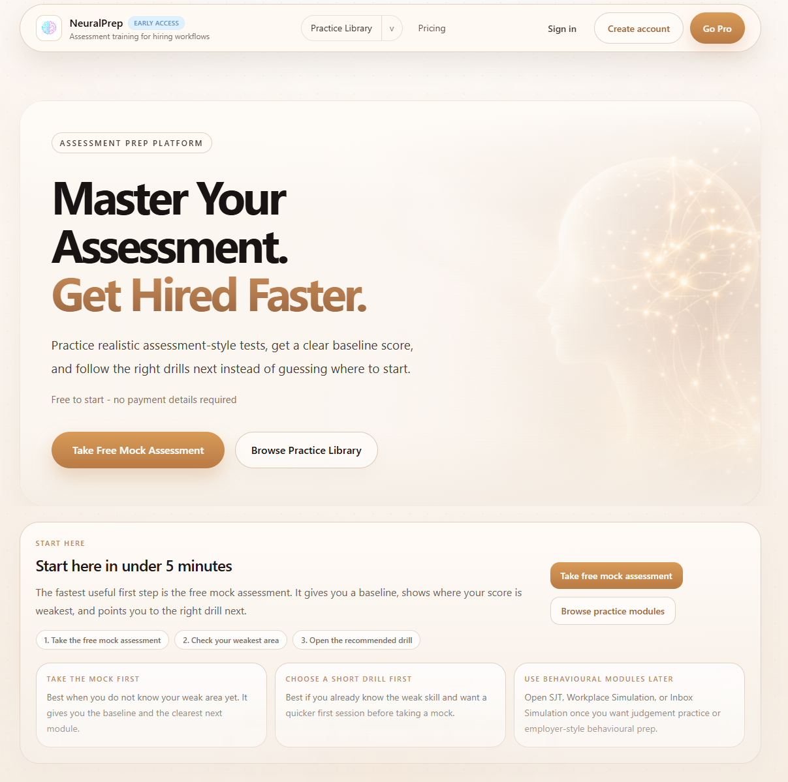
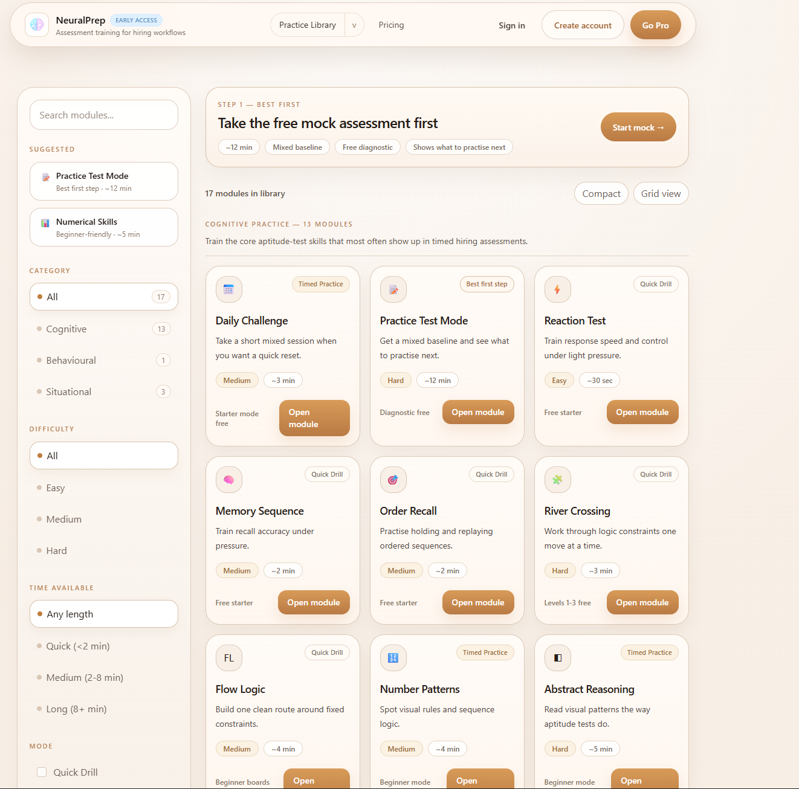
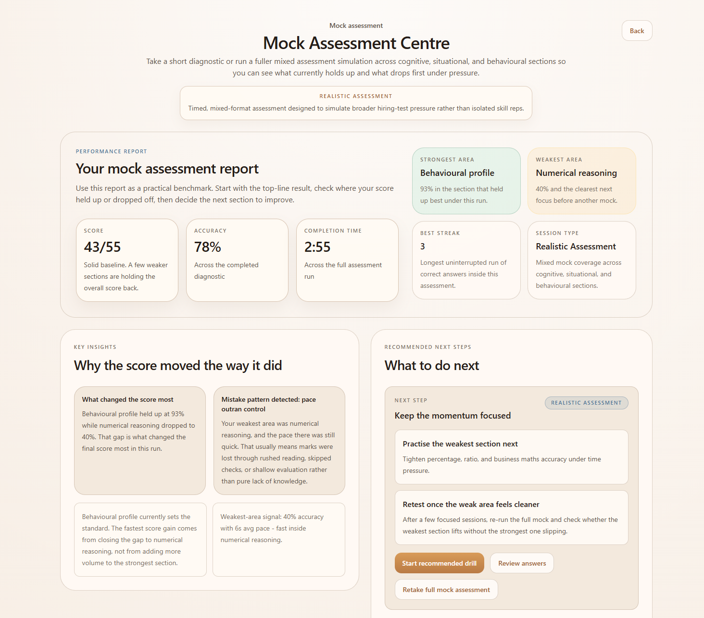
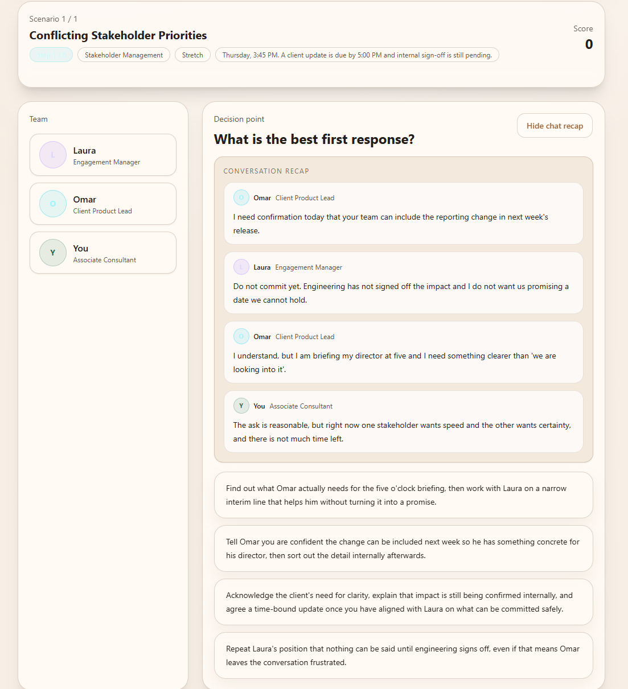
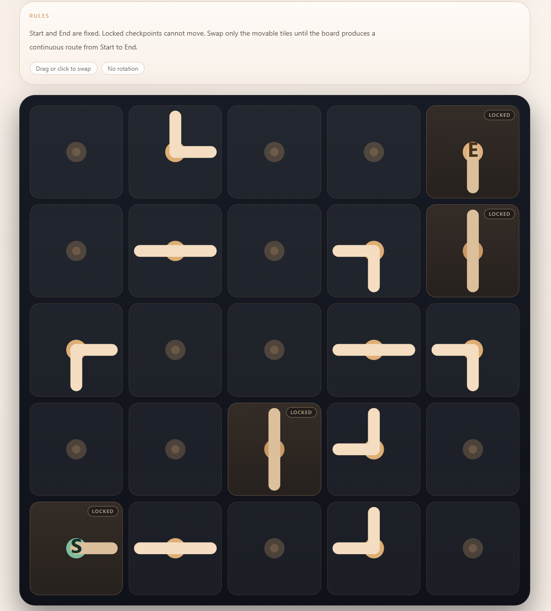

# NeuralPrep

  
  
  

A production assessment-prep platform designed to help candidates improve performance across cognitive, behavioural, and situational hiring assessments.

---

## Live Product

https://www.neuralprep.app

---

## At a Glance

- Full-stack SaaS product (not a demo)
- Real user flows: authentication, subscriptions, persistence
- Interactive assessment modules (not static quizzes)
- Personalised feedback and recommendation system
- Built around a continuous improvement loop:

Assess → Practise → Improve → Re-test

---

## Overview

Modern hiring increasingly relies on assessment-based processes, but most preparation tools are fragmented, unrealistic, or ineffective at guiding improvement.

NeuralPrep addresses this by combining:

- realistic mock assessments for baseline measurement  
- targeted practice modules for skill development  
- behavioural and situational simulations  
- structured performance feedback  
- recommendation-driven next steps  

The project has evolved into a cohesive product platform with reusable architecture, consistent UX patterns, and ongoing iteration.

---

## Why This Project Stands Out

### Real Product, Not a Demo
- Live, deployed, and actively developed  
- Includes full user flows, persistence, gating, and billing  
- Designed as a complete product experience  

### Full-Stack Ownership
- Next.js frontend architecture  
- Supabase-backed data layer  
- Authentication and subscription flows  
- Production deployment on Vercel  

### Product-Level Thinking
Focus extends beyond implementation into:
- user journeys  
- improvement loops  
- free vs Pro strategy  
- conversion-oriented UX  
- scalable feature expansion  

### UX and Product Iteration
Ongoing improvements include:
- consistent result screens  
- mobile responsiveness  
- navigation and discovery  
- action-first layouts  
- coaching-style feedback  

---

## Core Features

### Mock Assessments
Simulates real hiring pressure with:
- timed multi-section flow  
- performance breakdowns  
- strongest and weakest area identification  
- recommendation-driven next steps  

### Practice Library
Structured exploration system including:
- cognitive, behavioural, and situational modules  
- filtering and discovery  
- personalised recommendations  

### Cognitive Modules
Custom-built interactive challenges:
- numerical reasoning  
- abstract reasoning  
- number patterns  
- data sufficiency  
- attention and memory tasks  
- flow and logic systems  

### Behavioural and Situational Modules
Expanded beyond typical prep tools:
- situational judgement tests  
- behavioural profiling  
- workplace simulations  
- inbox simulations  

### Results and Feedback System
A central part of the product:
- shared result framework  
- performance interpretation  
- actionable next steps  
- deeper Pro insights  

---

## Technical Stack

**Frontend**
- Next.js (App Router)
- React
- TypeScript

**Styling**
- Tailwind CSS

**Backend**
- Supabase
- API routes

**Authentication and Billing**
- Supabase Auth
- Stripe

**Deployment**
- Vercel

---

## Engineering Highlights

### Modular Architecture
Supports multiple module types through shared systems:
- game logic  
- access gating  
- result handling  
- persistence  
- UI structure  

### Reusable Result Framework
Standardised across modules:
- summary  
- interpretation  
- next steps  
- review structure  

Allows different modules to scale in complexity while maintaining consistency.

### Personalised Recommendation System
Uses user activity to guide progression:
- weakest areas  
- follow-up modules  
- mock retakes  

Transforms the platform into a guided training experience.

### Responsive Product Design
Focused on maintaining quality across devices:
- prioritised key information on mobile  
- reduced visual clutter  
- improved interaction patterns  

### SEO as Product Entry
Landing pages structured as practice hubs:
- early access to exercises  
- conversion-focused layout  
- clear internal linking  

---

## Roadmap

The project is actively evolving with a focus on increasing product depth, personalisation, and realism.

### Completed
- [x] Core platform architecture (Next.js + Supabase + Stripe)
- [x] Authentication and subscription flows
- [x] Mock assessment system with multi-section structure
- [x] Practice library with cognitive, behavioural, and situational modules
- [x] Modular game/assessment framework
- [x] Shared result-screen system across modules
- [x] Personalised recommendations based on user activity
- [x] SEO-focused landing pages and practice hubs
- [x] Responsive UI improvements across key flows

### In Progress
- [ ] Expanding cognitive module set and difficulty scaling
- [ ] Improving mock assessment variation and composition
- [ ] Enhancing result interpretation and feedback depth
- [ ] Refining practice library navigation and discovery

### Planned
- [ ] Adaptive difficulty based on real-time performance
- [ ] More advanced workplace simulations with branching outcomes
- [ ] Long-term progress tracking and performance analytics
- [ ] Deeper personalised training paths and coaching layer
- [ ] Employer-specific assessment simulations

---

## Product Screens

### Homepage

### Practice Library

### Mock Assessment Results

### Workplace Simulation

### Flow Logic Module

---

## What This Demonstrates

- Full-stack application development  
- Scalable architecture for interactive systems  
- Product-focused UX design  
- Real-world SaaS considerations  
- Iteration on a live platform  

---

## Source Code

This repository is a portfolio showcase.

The full production codebase remains private while the product is actively developed.

I am happy to discuss:
- architecture decisions  
- system design  
- product strategy  

---

## Author

Dannie Watkins

- MSc Advanced Computer Science (AI focus)  
- BSc Computer Science (First Class)  

GitHub: https://github.com/DanWatkins03  

---

## Final Note

NeuralPrep is an actively evolving project focused on combining software engineering, AI-driven thinking, and product design to solve real-world problems in modern hiring processes.
